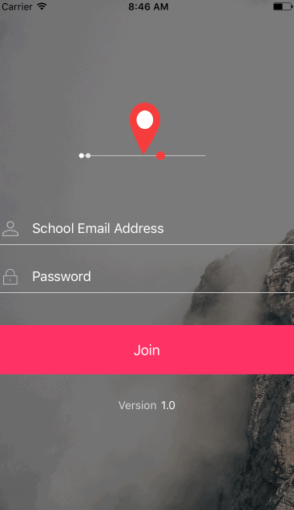
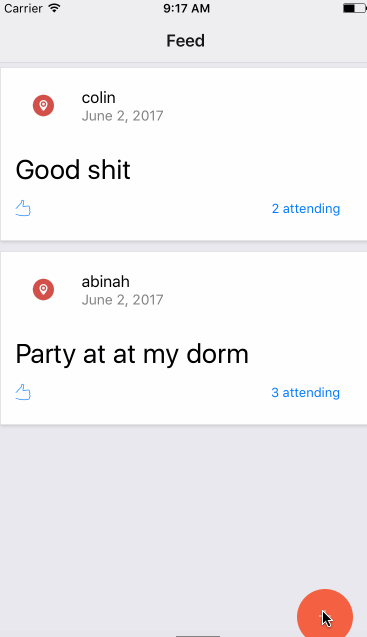

# Campus Events

This app lets you :
* Plan and broadcast 🎉 parties on your campus,
* Discover events near you.
Have fun!!! 🍻🍻🍻

## Building the app

1. Clone this repo.
2. Create a Firebase account https://firebase.google.com
3. Copy your config object to line 31 in `components/LoginScreen.js`
4. Also you may want to change the email format in line 42 in `components/LoginScreen.js`. It's set to 🐺 University of Washington by default.
5. `npm install`
6. To run the iOS Simulator: `react-native run-ios`
6.1 To run the Android Simulator: `react-native run-android`

